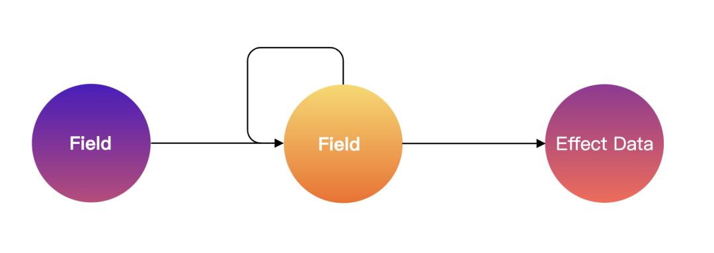

## 领域模型

前面问题中有提到表单的联动是非常复杂的，包含了字段间的各种关系，我们想象一下，大多数表单联动，基本上都是基于某些字段的值引发的联动，但是，实际业务需求可能会比较恶心，不仅要基于某些字段值引发联动，还会基于其他副作用值引发联动，比如应用状态，服务端数据状态，页面 URL，某个字段 UI 组件内部数据，当前字段自身的其他数据状态，某些特殊异步事件等等。用张图来描述：



从上图可以看到，想要达成一个联动关系，核心是将字段的某些状态属性与某些数据关联起来，这里的某些数据可以是外界数据，也可以是自身数据，比如字段的显示/隐藏与某些数据的关联，又比如字段的值与某些数据关联，还比如字段的禁用/编辑与某些数据关联，就举了 3 个例子，我们其实已经抽象出了一个最简单的 Field 模型：

```js
interface Field {
  value: any
  visible: boolean
  disabled: boolean
}
```

当然，Field 模型仅仅只有这 3 个属性吗？肯定不是，如果我们要表达一个字段，那么字段的路径一定要有，因为要描述整个表单树结构，同时，我们还要管理起字段对应 UI 组件的属性，比如 Input 和 Select 都有它的属性，举个例子，Input 的 placeholder 与某些数据关联，或者 Select 的下拉选项与某些数据关联，这样就能理解了吧。所以，我们的 Field 模型可以是这样：

```js
interface Field {
   path:string[],
   value:any,
   visible:boolean,
   disabled:boolean,
   component:[Component,ComponentProps]
}
```

我们加了 component 属性，它代表了字段所对应的 UI 组件和 UI 组件属性，这样就实现了某些数据与字段组件属性关联，甚至是与字段组件关联的能力。还有吗？当然还有，比如字段的外包裹容器，通常我们都叫 FormItem，它主要负责字段的外围的交互样式，比如字段标题，错误提示的样式等等，如果我们想要囊括更多联动，比如某些数据与 FormItem 的联动，那就得把外包裹容器也加进去。还有很多很多属性，这里没法一一列举。

从上面的思路中我们可以看到，为了解决联动问题，不管我们怎么抽象，最终还是会抽象出字段模型，它包含了字段相关的所有状态，只要去操作这些状态就能引发联动。

关于精确渲染，我们已经确定可以选用类似 Mobx 的 Reactive 方案，虽然是重新造了一个轮子，但是，Reactive 这种模式始终还是很适合抽象响应式模型，所以基于 Reactive 的能力，Formily 经过不断试错与纠正，总算设计出了真正优雅的表单模型。这样的表单模型，解决的是表单领域问题，所以也称之为领域模型，有了这样的领域模型，我们就能让表单的联动变得可枚举可预测，这样也为后面要说的协议描述联动打下了坚实基础。


