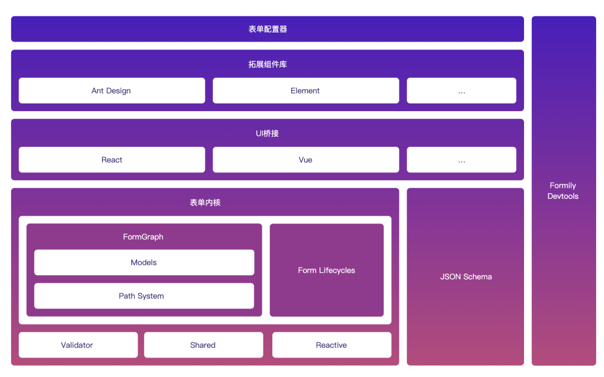

## 分层架构
前面讲了对于一开始的各种问题的解法，那么现在我们如何设计才能让 Formily 更加自洽且优雅呢？

这张图主要将 Formily 分为了内核层，UI 桥接层，扩展组件层，和配置应用层。

内核层是 UI 无关的，它保证了用户管理的逻辑和状态是不耦合任何一个框架，这样有几个好处：

逻辑与 UI 框架解耦，未来做框架级别的迁移，业务代码无需大范围重构

学习成本统一，如果用户使用了@formily/react，以后业务迁移@formily/vue，用户不需要重新学习

JSON Schema 独立存在，给 UI 桥接层消费，保证了协议驱动在不同 UI 框架下的绝对一致性，不需要重复实现协议解析逻辑。

扩展组件层，提供一系列表单场景化组件，保证用户开箱即用。无需花大量时间做二次开发。

